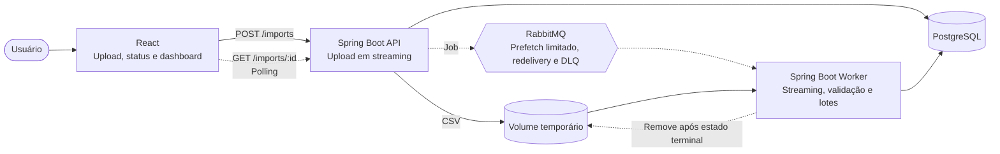

# Arquitetura da solução

## Contexto

O sistema precisa receber arquivos CSV com milhões de transações, processá-los sem crescimento de memória proporcional ao arquivo e manter consultas e renderização responsivas. A arquitetura prioriza esses critérios do enunciado e evita componentes sem necessidade demonstrável.

## Visão geral

O [system design original](docs/decisions/system-design-geosapiens.png) é a referência visual da topologia e será mantido durante a implementação. Os detalhes abaixo explicam como seus componentes serão implementados sem acrescentar serviços ao desenho.



## Estilo arquitetural

O backend será um monólito modular. API e Worker compartilham domínio e casos de uso, mas executam funções distintas. Essa escolha evita duplicar regras e contratos sem exigir serviços independentemente evoluídos pelo escopo atual.

A Clean Architecture será aplicada de forma leve:

- o domínio contém regras e estados sem depender de Spring, SQL ou RabbitMQ;
- a camada de aplicação coordena casos de uso e declara apenas as portas necessárias;
- adaptadores externos implementam HTTP, persistência, CSV, armazenamento e mensageria;
- dependências de código apontam para as regras internas;
- DTOs HTTP e representações do banco não atravessam as fronteiras como modelos de domínio.

Não haverá uma interface para cada classe. Uma abstração só será criada quando existir uma fronteira, mais de uma implementação relevante ou necessidade concreta de isolamento em teste.

## Fluxo de ingestão

1. A API valida metadados básicos e grava o corpo multipart diretamente no volume temporário.
2. A API cria o job e publica sua referência no RabbitMQ.
3. A resposta `202 Accepted` informa que o pedido foi aceito, não que a importação terminou.
4. O Worker lê o arquivo progressivamente, valida cada linha e acumula um lote limitado.
5. Cada lote confirma registros válidos, rejeições e progresso em uma única transação.
6. Depois do estado terminal confirmado, o Worker confirma a mensagem e remove o arquivo.

A memória deve variar com buffers, tamanho máximo do registro e tamanho do lote, não com o total de registros. Além do streaming do arquivo, `app.csv.max-record-characters` limita cada registro lógico antes que o Commons CSV materialize seus campos; o valor inicial é `4096` caracteres e permanece configurável. Quebras de linha dentro de campos quoted continuam pertencendo ao mesmo registro, portanto não contornam a barreira. O trade-off está no ADR 0017.

## Assincronia e backpressure

RabbitMQ representa uma fila de trabalho: um arquivo produz um job consumido por um Worker. O prefetch e a concorrência serão limitados para impedir que uploads simultâneos abram trabalho ilimitado contra PostgreSQL.

Os valores de prefetch, concorrência, lote e intervalo de polling serão configurações explícitas. Seus valores iniciais serão hipóteses e somente serão defendidos como adequados após testes e benchmark.

Um arquivo não será dividido entre vários Workers no primeiro escopo. Isso evita coordenação de offsets e reprocessamento parcial sem impedir paralelismo entre arquivos independentes.

## Falhas e idempotência

A entrega é pelo menos uma vez. O Worker confirma a mensagem somente após o processamento alcançar um estado terminal persistido. Uma falha antes da confirmação permite redelivery.

Cada registro importado preserva o número de sua linha de origem. A restrição `UNIQUE (import_id, source_row)` impede duplicações quando um lote já confirmado é reenviado.

Erros serão classificados:

- linha inválida: registrada como rejeição e não interrompe o arquivo;
- falha transitória de infraestrutura: permite nova tentativa limitada;
- falha definitiva do job: encerra o job como `FAILED` e preserva o motivo;
- tentativas esgotadas: mensagem enviada à DLQ para inspeção.

Não haverá captura genérica que transforme falha em sucesso, retry infinito ou fallback silencioso.

Para falhas de processamento, o orçamento atual é a entrega original mais uma redelivery. Depois que uma mensagem já redelivered falha novamente, ela não volta para a fila principal. O Worker tenta registrar `FAILED` e rejeita a mensagem sem requeue para que o RabbitMQ a encaminhe à DLQ. Se até a persistência de `FAILED` estiver indisponível, a mensagem também segue para a DLQ: o job pode permanecer temporariamente não terminal e exigir reconciliação, mas o sistema evita transformar uma indisponibilidade do PostgreSQL em um loop quente de consumo e requeue. O trade-off completo está no ADR 0016.

### Limite de consistência entre banco e broker

A criação do job e a intenção de publicação serão confirmadas na mesma transação do PostgreSQL por meio de Transactional Outbox. Um publicador interno da API enviará as mensagens pendentes ao RabbitMQ e somente as marcará como publicadas depois do publisher confirm.

Uma falha antes da publicação mantém a mensagem pendente. Uma falha depois da confirmação do broker e antes da atualização do Outbox pode produzir publicação duplicada; por isso, o consumidor continuará idempotente. Tentativas e último erro permanecerão persistidos, sem retry local invisível. Os detalhes e alternativas estão no ADR 0007.

## Máquina de estados

Estados planejados:

```text
RECEIVED -> QUEUED -> PROCESSING -> COMPLETED
                              |-> COMPLETED_WITH_ERRORS
                              |-> FAILED
```

Falhas antes do processamento também podem levar `RECEIVED` ou `QUEUED` a `FAILED`. Repetir o início de um job que já está em `PROCESSING` é idempotente para suportar redelivery sem apagar o instante original de início.

Somente o caso de uso responsável poderá realizar transições. Estados terminais não retornarão a `PROCESSING` por causa de redelivery. As regras exatas e a concorrência entre atualizações serão cobertas por testes.

## Fronteiras transacionais

Cada lote será a unidade transacional do processamento:

- gravação de transações válidas;
- gravação dos erros de linhas do lote;
- atualização dos contadores do job.

Um commit único para todo o arquivo reteria uma transação extensa. Um commit por linha multiplicaria round-trips. O lote limitado equilibra essas necessidades, e seu tamanho será medido.

## Consultas e índices

A consulta de status usa a chave primária de `ingestion_jobs` e retorna apenas estado e contadores persistidos. O payload de polling tem tamanho constante; erros detalhados não são embutidos nele.

Os erros usam keyset pagination por `source_row`: `import_id = ? AND source_row > ? ORDER BY source_row`. A constraint única `(import_id, source_row)`, criada originalmente para idempotência, já fornece um índice compatível com essa consulta; não será criado um índice redundante apenas para a listagem de erros.

As transações usam keyset pagination por `id`: `import_id = ? AND id > ? ORDER BY id`. O índice `(import_id, id)` é criado junto ao endpoint porque essa consulta agora existe e a chave primária `id` isolada não organiza os registros primeiro por importação. `source_row` permanece disponível para rastreabilidade, mas não é o contrato de navegação da coleção persistida.

O dashboard usa `GROUPING SETS` em uma única instrução para obter total, categoria e mês no mesmo snapshot. O mês é derivado explicitamente em UTC. O índice de cobertura `(import_id) INCLUDE (category, occurred_at, amount)` existe porque a consulta filtra por importação e precisa dessas três colunas; seu custo/benefício será validado no benchmark com `EXPLAIN (ANALYZE, BUFFERS)` antes de ser defendido como configuração ótima.

## Frontend

Polling atende ao acompanhamento unidirecional permitido pelo enunciado sem conexões persistentes. `GET /imports/{id}` lê o estado durável do job e não mantém progresso paralelo em memória. A resposta inclui `processedRows`, `acceptedRows` e `rejectedRows`; percentual só será exibido se o total de linhas puder ser obtido de forma durável sem uma passagem adicional injustificada pelo arquivo.

O status não carrega detalhes de todos os erros. `GET /imports/{id}/errors` usa paginação por cursor para que cada resposta permaneça limitada, inclusive quando o CSV produz muitas rejeições.

`GET /imports/{id}/transactions` também usa paginação por cursor. Paginação server-side limita transferência e trabalho do banco; a virtualização do React limitará separadamente os elementos montados no DOM. As duas técnicas resolvem problemas diferentes e serão usadas em conjunto na lista principal.

`GET /imports/{id}/analytics` entrega os totais do dashboard sem transportar registros individuais para a aplicação. Durante o processamento, a resposta representa um snapshot consistente dos lotes já commitados; o estado terminal continua pertencendo ao endpoint de status.

## Observabilidade mínima

A observabilidade permanece no adapter de infraestrutura e não altera domínio, casos de uso ou estado persistido.

- o console usa logging estruturado Logstash nativo do Spring Boot;
- conclusões do Worker registram `jobId`, status, duração e contadores processados/aceitos/rejeitados;
- redelivery, DLQ e necessidade de reconciliação usam campos estáveis, sem conteúdo financeiro do CSV;
- Micrometer registra `ingestion.worker.deliveries` e `ingestion.worker.delivery.duration` com a tag de baixa cardinalidade `outcome=ack|redelivery|dead_letter`;
- `jobId`, nome de arquivo e motivos de falha não são tags de métrica para evitar cardinalidade não limitada;
- Actuator fornece métricas automáticas de JVM, processo, HTTP e RabbitMQ e expõe `health`, `info` e `metrics` para inspeção local.

Telemetria é *best effort*: falhar ao registrar uma métrica não pode modificar ACK, retry, DLQ ou estado do job. PostgreSQL continua sendo a fonte de verdade. A decisão completa está no ADR 0018.

## Fora do escopo

A solução oferece recuperação de falhas na camada de processamento assíncrono por meio de mensagens persistentes, confirmação manual, redelivery, tentativas limitadas e DLQ no RabbitMQ. A alta disponibilidade da API, do PostgreSQL, do broker e do armazenamento temporário não faz parte deste desafio.

Também ficam fora do escopo inicial Kafka, Redis, Kubernetes, WebSocket, object storage e divisão de um mesmo arquivo entre Workers. Essas opções devem ser reconsideradas apenas diante de requisitos que necessitem de suas propriedades.
